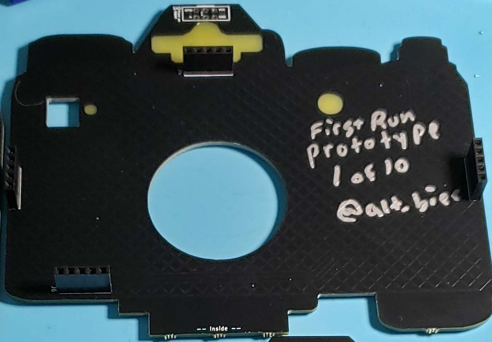
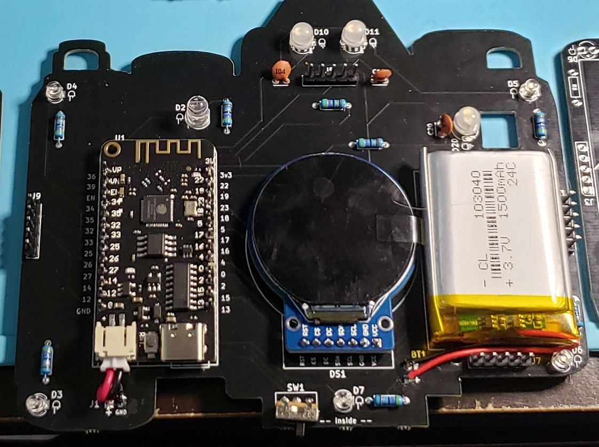

<!-- Links? -->

<!-- Image of Finished Badge here -->

# BTV Camera Badge Instructions

Read below for assembly instructions for the DefCon32 BTV Camera Badge.

## Component List

This is the list of components that you should have available for the assembly.

*  Camera Badge Kit Bag
	*  1x Top PCB board
	*  1x Bottom PCB board
    *  1x Screen
	*  1x ESP23 Dev Board /w LIPO connector
	*  1x 3-pin Switch
	*  3x Addressable LEDs
	*  5x Blue LEDs 
	*  1x Bright White LED 
	*  8x 47 Ohm resistors
	*  3x 50V Capacitors
	*  1x LIPO Battery 3.7V 1200mAh
		* 1x Thin Adhesive Strip for Battery
	*  1x Micro PH/JST Connector (This may be on the end of the battery cable)
	*  1x Male Header 1x40 breakaway
	*  4x Female Headers 1x5
	*  1x SAO Connector 2x3 6-pin with wrong-way prevention 

## Reference Photos

<!-- Picture Top  -->

This PCB will be referenced as the "Top PCB" in the following instructions

<!-- Picture Bottom -->

This PCB will be referenced as the "Bottom PCB" in the following instructions

## Soldering Instructions

After ensuring you have all the parts lets begin soldering.  These steps are the listed in order to make things as convenient as possible.  Read the instruction under the part first before beginning to solder.

We will start with the bottom board of the badge please ensure the components themselves are on the inside of the badge as labeled on the center bottom of the PCB "-- Inside --"
*  Solder Resistors
	* There are 8 resistors and the locations are marked as a small rectangle with R# on the inside.  
	* Polarity does not matter for these.
* Solder Blue LEDs
	* There are five blue LEDs, these are the smaller two pin LEDs.  
	* They go into the circles with the D# label.  
	* Do NOT put a blue LED into the D2 location.  
	* Please note polarity listed under D# and the shown wire lengths match as shown on the board.
*  Solder Capacitors
	* There are three capacitors.
	* They go into the locations with the circles that have a line above and below the circles.
	* Their locations are marked as C10, C11, and C20.
	* Polarity does not matter for these.
*  Solder the Switch
	* The 3 pin switch goes into the location marked SW1.
	* To get the bend easily, place the switch onto board and mark where the wire go over the holes. Then use a flat edge to start the bend, and bend the wires to 90 degrees.
*  Solder Addressable LEDS
	* There are 4-pin Addressable LEDs.
	* These go into the circles marked D10, D11, and D20 on the board.
	* Polarity matters, ensure the wire lengths on the LED match the lengths shown on the board.
*  Solder the White LED
	* There is one larger 2 pin LED.
	* The white LED goes into the location marked D2.
	* Polarity matters, ensure the wire lengths on the LED match the lengths shown on the board.
*  Solder the 1x5 Male Header 
	* Take the male header 1x40 breakaway and create four 1x5 male Headers.
	* Solder these into the four rectangles marked J#.  
*  Solder the ESP32 board
	* Ensure the ESP32 board is placed correctly as indicated on the PCB.
	* When trying to get the initial placement it's best to start with opposing corners to ensure placement is correct.
*  Solder the Screen
	* Align the screen pins to match as shown in the location market DS1 on the PCB.
	* You can place the leftover breakaway header pins on the top side of the screen to help keep it level as you're soldering.
	* To ensure the fit solder the far pins first, its easier to refloat the solder in one pin than several.
*  Solder the Battery
	* Keep the solder iron away from the battery, high heat excites lithium in a violent manner.
	* When cutting the battery wires it is best practice to cut one wire at a time to avoid shorting anything and releasing the machine spirit.
	* Remove the film from the back of the battery stick and place the battery, wires toward the bottom, on the location marked with battery.
	* If the Micro PH/JST Connector is connected to the battery measure of the cable length you need to connect the wires to + and GND holes under the BT1 label.
	* Cut the connector off the battery, while ensuring you have enough wire on the connector left to make the connection for ESP32 board.
	* Double check the switch is in the "OFF" position 
	*Plug the PH/JST connector into the ESP32 board.  Note the polarity on the board (red wire is + and black wire is GND.
	* From the PH/JST connector solder the black wire into the GND socket next to the spot marked J1.
	* Solder the red wire from the connector into the + socket next to the spot marked J1.
	* Move back to the wires attached to the battery.
	* Solder the black wire into the GND socket under the spot marked BT1.
	* Solder the red wire into + socket
	
Set aside the bottom PCB and move to the top PCB.  Again except for the SAO connector the components will be on the side of the badge marked "-- Inside --"

*  Solder the 1x5 Female Headers
	* There are four locations for the Female Header
	* These go into the rectangles marked J#
* Solder the SAO connector
	* Flip the top PCB over
	* The 2x3 SAO connector goes into the 2x3 sockets on the top center of the badge.
	* Polarity matters for this.  The "wrong-way prevention bump" should be on the top, as indicated on the inside of the PCB.
	
		

## Additional Assembly Steps

Everything should be soldered onto the boards at this point.  
You will have extra male headers, but if there's anything else extra you may want to refer to the reference pictures above to figure out what went wrong.

* Attach PCBs
	* Align the female and male 1x5 headers from the top and bottom PCBs
	* Using a gentle but firm pressure press the two PCBs together.
	
* Power On
	* Flip the switch to on and catch them DeAuths.
	* NOTE: to charge the battery, the power switch must be set to the ON position.
	* Charge the battery by connection the USB-C connection on the ESP32 board to a power source.
	* Testing has indicated a full charge will last roughly seven hours, enough to look like a cool person for almost an entire work shift.	
	
* Attach Lanyard
	* Take one end of lanyard and put the clip in the clip hole.
	* Take the other end of the lanyard and put that one in the other clip hole.
	

Credits:
-- Badge Architect/Design: [@alt_bier](https://twitter.com/alt_bier) 
-- Badge Assembly/Design: DeCert
-- ESP23 Code: Emilia
-- Badge Assembly Instructions: Sh1tty
