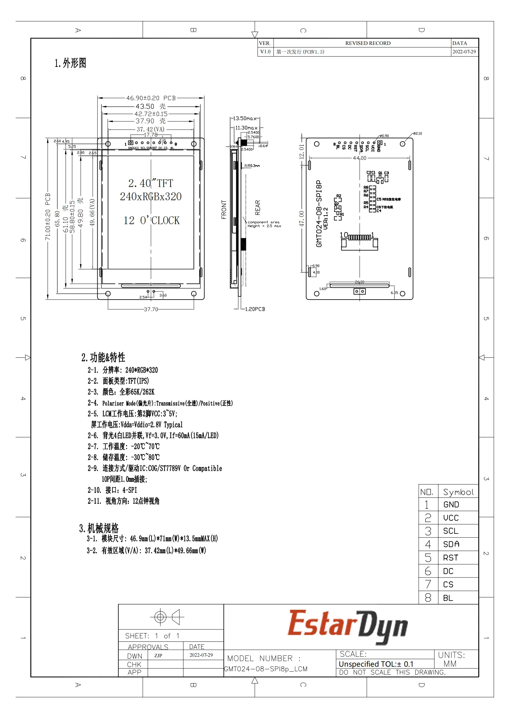
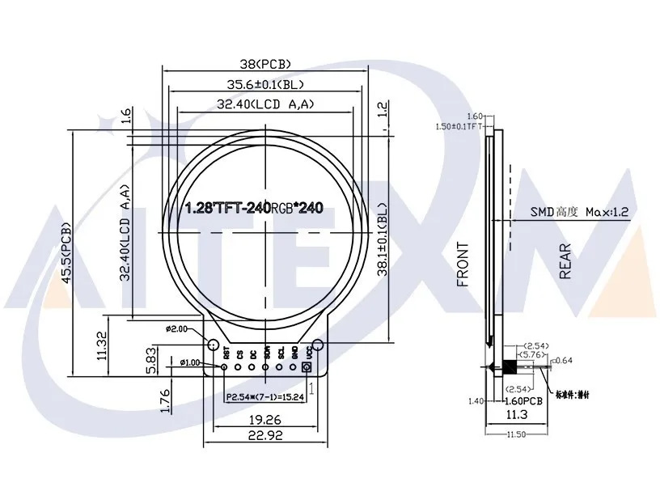
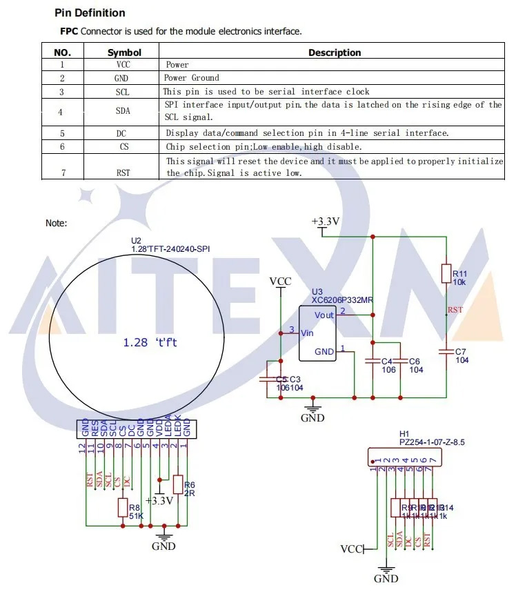

# Parts-List.md

## Screen

2.4inch LCD Display Module 240×320 Resolution RGB Colors LCD Monitor 2.4" TFT Screen SPI Interface Board

https://www.amazon.com/2-4inch-Display-240%C3%97320-Resolution-Interface/dp/B0CGDQN811

https://www.aliexpress.us/item/3256806123904425.html

https://www.aliexpress.us/item/3256805947033530.html

https://www.aliexpress.us/item/3256805989033289.html

1.28 inch TFT LCD Display Module Round RGB 240*240 GC9A01 Driver 4 Wire SPI Interface

https://www.amazon.com/Teyleten-Robot-Display-Interface-240x240/dp/B0B7TFRNN1

https://www.aliexpress.us/item/3256804295713253.html

https://www.aliexpress.us/item/3256806201295818.html

## Dev Board 

ESP32 Development Board TYPE-C WROOM-32 WiFi+Bluetooth BT+BLE MCU Module

https://www.amazon.com/gp/product/B0B19DXFHX/

https://www.aliexpress.us/item/3256805348040808.html

## Dev Board with LIPO builtin

ESP32 Lite V1.0.0 Wifi Bluetooth Development Board ESP32 REV1 CH340G 4MB TYPE-C
NEW SMALLER CHIP and Dev Board includes LIPO connector and charge circuit

https://www.amazon.com/AITRIP-Bluetooth-Development-Antenna-MicroPython/dp/B0BCJXDYLY

https://www.aliexpress.us/item/3256804515306833.html

ESP32-D0WDQ6 (and other QFN) Chip Specs:
https://www.mouser.com/datasheet/2/891/Espressif_Systems_01292021_esp32-1991551.pdf

## LIPO Charge Daughter Board

A small pcb to add on to the badge to perform LIPO battery charging using its own USB type C connector

https://www.amazon.com/dp/B0C2VD3ZW3

https://www.aliexpress.us/item/3256806158767195.html

## LIPO Boost Converter Daughter Board

A small pcb to add on to the badge to perform DC-DC voltage boost from the LIPO 3.7V battery (4.2V-3.2V) to 9V or 12V for the VIN on the ESP dev board

https://www.amazon.com/dp/B08M19C7MM

https://www.aliexpress.us/item/3256802672103106.html

This one may wrk better:
A small pcb to add on to the badge to perform DC-DC voltage boost from the LIPO to 5V for the VIN on the ESP dev board

https://www.amazon.com/gp/product/B08RJ8769R

https://www.aliexpress.us/item/2255799830473720.html

## Buttons

## LEDs

## Standoffs

## Battery

